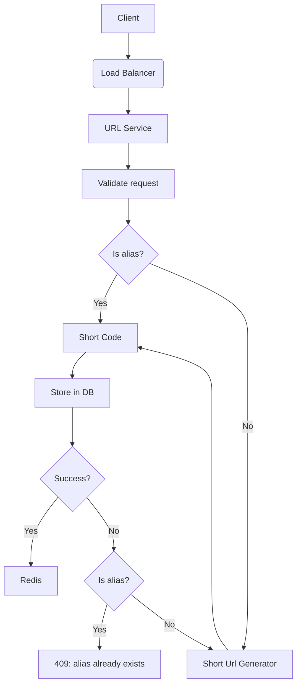
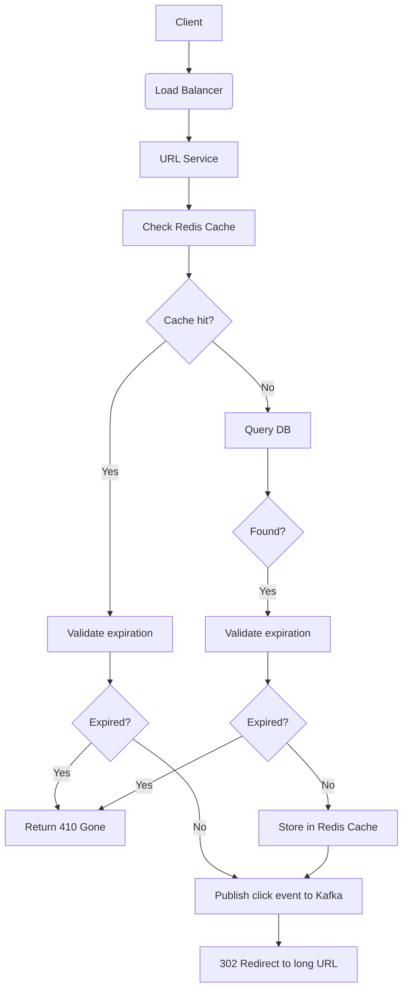
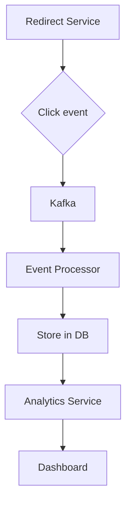
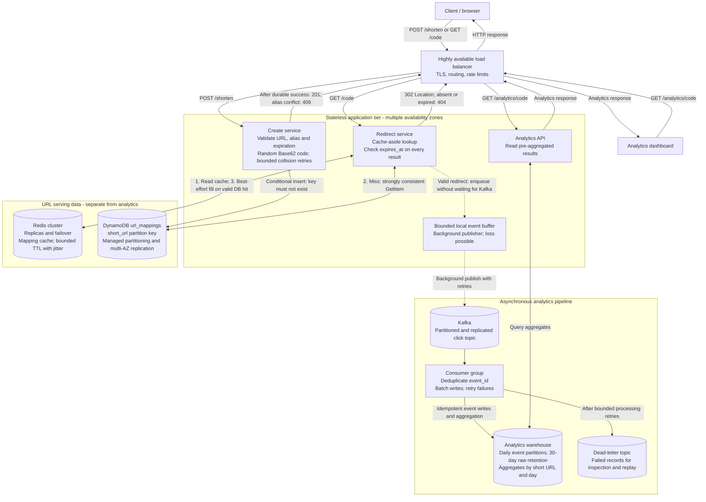

Framework:
1. Requirements:
   - Functional requirements
   - Non-functional requirements
2. Scale:
    - Quantity per seconds (QPS)
    - Read heavy
    - Write / Read ratio
3. Design API
4. Design model + DB schema
5. High level architecture
6. Core components (bottlenecks, Scalability, Reliability etc.)
7. Final architecture diagram
8. Trade-offs

# 1. Requirements
## Functional requirements:
- The system should allow users to convert long URLs into short URLs.
- Each short URL should be unique and map to a specific long URL.
- When click on the short URL, it should redirect to the original long URL.
### Example:
  - POST: /shorten 
    - Request body: { "longUrl": "https://www.example.com/some/long/url" }
    - Response body: { "shortUrl": "http://short.ly/abc123" }
  - GET: /{shortUrl}
    - HTTP 302 redirect to the original long URL.
### Question for interview: 
- Do we need to support custom short URLs, expiration, or analytics (click count, referrer, etc.)?
### Example:
  - Custom short URL: /shorten with 
    - request body { "longUrl": "https://www.example.com/some/long/url", "customAlias": "myalias" }
    - response body { "shortUrl": "http://short.ly/myalias" }
  - Expiration: /shorten with 
    - request body { "longUrl": "https://www.example.com/some/long/url", "expiration": "2024-12-31T23:59:59Z" }
    - response body { "shortUrl": "http://short.ly/abc123", "expiration": "2024-12-31T23:59:59Z" }
  - Analytics: /analytics/{shortUrl} with
    - response body { "clickCount": 123, "referrers": ["https://www.google.com", "https://www.facebook.com"] }
## Non-functional requirements:
- Very heavy read traffic, 1 short URL can be clicked millions of times, but only a few thousand new short URLs are created per day.
  - Example: 1 short URL -> 1 million clicks per day
- Reason:
  - Low latency: Users expect the redirection to be fast, ideally under 100ms.
  - High availability: The service should be available 24/7, as users may access short URLs at any time.
  - Scalability: The system should be able to handle a large number of requests, especially for popular short URLs.
  - Durability: The mapping between short URLs and long URLs should be persistent and not lost over time.
  - Unique short URLs: The system should ensure that each short URL is unique and does not collide with existing ones.

# 2. Scale
## Question for interview:
- How many new short URLs are created per day?
- How many clicks per day?
### Example:
- New short URLs per day: 1M -> per second: 1M / 86400 ≈ 11.57 ≈ 12 QPS -> peak x10 = 120 QPS
- Clicks per day: 1B -> per second: 1B / 86400 ≈ 11574 ≈ 11.6K QPS -> peak x10 = 116K QPS
- Read heavy: 1B clicks vs 1M new short URLs, ratio = 1000:1
- Write / Read ratio: 1:100
- QPS (Queries Per Second): 
  - Write QPS: 120
  - Read QPS: 116000
#### Solution: 
- Caching: Use a caching layer (e.g., Redis, Memcached) to store frequently accessed short URL mappings in memory, reducing the load on the database and improving response times.

# 3. Design API
- Create Short URL:
  - Endpoint: POST /shorten
  - Request body: 
    ```json
    {
        "longUrl": "https://www.example.com/some/long/url",
        "customAlias": "optional",
        "expiration": "optional"
    }
    ```
  - Response body:
    ```json
    {
        "shortUrl": "http://short.ly/abc123",
        "expiration": "optional"
    }
    ```
- Redirect Short URL:
  - Endpoint: GET /{shortUrl}
  - Response: 
    - HTTP 302 redirect to the original long URL.
    - If the short URL does not exist or has expired, return HTTP 404 Not Found.
- Analytics:
  - Endpoint: GET /analytics/{shortUrl}
  - Response body:
    ```json
    {
        "clickCount": 123,
        "referrers": ["https://www.google.com", "https://www.facebook.com"]
    } 
    ```

# 4. Design model + DB schema
## Database schema:
### Table: url_mappings
  - Use NoSQL database (e.g., DynamoDB, MongoDB), because doesn't require complex joins and can scale horizontally.
  - Columns:
    - short_url (primary_key)
    - long_url
    - expires_at (nullable|timestamp)
    - created_at (timestamp)
    - updated_at (timestamp)
  - Note:
    - short_url: unique short URL or custom alias, because they are the same semantically, we can use the same column for both.
### Table: event_logs
  - Use NoSQL database (e.g., MongoDB, Cassandra), because we need to store a large number of click events, and we can add more fields in the future, so we need a flexible schema.
  - Columns:
    - event_id (primary_key)
    - short_url (foreign_key to url_mappings.short_url)
    - clicked_at (timestamp)
    - referrer (nullable|string)
    - user_agent (nullable|string)
    - created_at (timestamp)
### Analytics: 
- Depends on the analytics dashboard requirements, we can create a separate table for analytics base on aggeration event_logs table.
  - Example: daily_analytics, monthly_analytics, daily_click_analytics, etc.
- We can use elasticsearch for analytics, because it can handle large amount of data and provide fast search and aggregation capabilities.

# 5. High level architecture
## CREATE HIGH LEVEL ARCHITECTURE DIAGRAM

## REDIRECT HIGH LEVEL ARCHITECTURE DIAGRAM

## Analytics HIGH LEVEL ARCHITECTURE DIAGRAM


# 6. Core components
## Short URL must be **unique** + **Scalability**
### Short URL: http://short.ly/a79z1Kd - How a79z1Kd unique for each billions of short URLs?
- Hash long URL: 
  - Use a hash function (e.g., MD5, SHA-256) to generate a hash of the long URL.
  - Take the first N characters of the hash as the short URL.
  - Example: **SHA256**("https://www.example.com/some/long/url") = "**a79z1Kd**..." -> short URL = "http://short.ly/a79z1Kd"
  - Problem: **Hash collision**, two different long URLs may generate the same hash, resulting in the same short URL.
    - Example: 
      - SHA256("https://www.example.com/some/long/url1") = "a79z1Kd..."
      - SHA256("https://www.example.com/some/long/url2") = "a79z1Kd..."
      - Both long URLs will have the same short URL "http://short.ly/a79z1Kd", which is not acceptable.
    - **Solution 1**:
        - Check if the generated short URL already exists in the database.
        - If it exists, append a random string or increment a counter to the short URL and check again until a unique short URL is found.
        - ```mermaid
          graph TD;
            A[Generate short URL] --> B{Check if short URL exists in DB}
            B -- No --> C[Store in DB] --> D[Return short URL]
            B -- Yes --> E[Append random string or increment counter] --> A
          ```
        - Example: 
            - First attempt: "http://short.ly/a79z1Kd" (exists)
            - Second attempt: "http://short.ly/a79z1Kd1" (exists)
            - Third attempt: "http://short.ly/a79z1Kd2" (unique, use this one)
        - **Cons**:
            - Look up in the database for each attempt, which can be slow if there are many collisions.
            - 1 url can have multiple short URLs, which is not ideal for analytics and user experience.
    - **Solution 2**:
        - Random Base62 encoding
        - We have (0-9, a-z, A-Z) = 62 characters, if length = 7, we can have 62^7 = **3.5 billion** unique short URLs.
        - randomBase62(https://www.example.com/some/long/url) = "a79z1Kd" -> if collision, generate another random string until unique short URL is found.
        - ```mermaid
          graph TD;
            A[Generate random Base62 string] --> B{Check if short URL exists in DB}
            B -- No --> C[Store in DB] --> D[Return short URL]
            B -- Yes --> E[Generate another random Base62 string] --> A
          ```
        - **Pros**:
            - No need to hash the long URL, which can be slow for long URLs.
            - Each short URL is unique and does not depend on the long URL, which is better for analytics and user experience.
        - **Cons**:
            - Random generation may lead to collisions, but the probability is low if the length is sufficient (e.g., 7 characters).
            - Need to check for uniqueness in the database, which can be slow if there are many collisions
    - **Solution 3**:
        - Auto-increment ID + Base62 encoding
        - Use an auto-increment ID (e.g., from a database sequence) to generate a unique short URL.
        - Example:
            - ID = 123456789 -> Base62(123456789) = "a79z1Kd" -> short URL = "http://short.ly/a79z1Kd"
            - Because the ID is unique and auto-incremented, Base62(id) will always generate a unique short URL.
        - **Pros**:
            - No need to check for uniqueness in the database, as the ID is guaranteed to be unique.
            - Each short URL is unique and does not depend on the long URL, which is better for analytics and user experience.
        - **Cons**:
            - If the ID is predictable, it may be possible to guess other short URLs -> **security concern**.
            - Distributed systems may have issues with auto-increment IDs
            - Example: if we have multiple database nodes, we need to ensure that the IDs are unique across all nodes, which can be challenging.
            - To solve this, we go to Solution 4 (snowflake ID)
    - Solution 4:
        - Snowflake ID + Base62 encoding
        - **Snowflake ID = timestamp + machine_id + sequence_number**
        - timestamp: 41 bits, machine_id: 10 bits, sequence_number: 12 bits
        - Example:
            - timestamp = 2024-06-01 12:00:00 -> 41 bits
            - machine_id = 1 -> 10 bits
            - sequence_number = 1 -> 12 bits
            - Snowflake ID = 41 bits + 10 bits + 12 bits = 63 bits
            - Base62(63 bits) = "a79z1Kd"
        - **Pros**:
            - No need to check for uniqueness in the database, as the Snowflake ID is guaranteed to be unique.
            - Each short URL is unique and does not depend on the long URL, which is better for analytics and user experience.
            - Can be used in distributed systems without issues.
        - **Cons**:
            - Need to implement a distributed unique ID generator, which can be complex.
            - No need to start from beginning, when we need to scale, we can use multiple machines to generate unique IDs without collisions.
## Redirect is read heavy -> We need **low latency**
- Problem: 1M short URLs, 1B clicks per day, 1B request read to DB -> **bottleneck**
- Solution: Use **caching layer (e.g., Redis, Memcached) to cache the short URL**, so that we don't need to query the database for every redirect request.
- Question is: What kind of **caching strategy** we should use? How to handle **cache invalidation**? How to handle **cache miss**? How to handle **cache stampede, cache penetration, cache avalanche**?
- Caching strategy: **Cache Aside + Write Around**
- Cache Aside:
    - When a request comes in, check the cache first.
    - If the short URL is found in the cache, return the long URL.
    - If the short URL is not found in the cache, query the database for the long URL, store it in the cache, and return the long URL.
    - If the short URL is expired, return 410 Gone.
- Write Around:
    - When a new short URL is created, store it in the database first and remove it from the cache if it exists.
- Cache Invalidation: 
    - When a short URL is created, we can store it in the cache with a TTL (time to live) of 1 day. 
    - When a short URL is updated or deleted, we can remove it from the cache.
- Cache Miss:
    - When a cache miss occurs, we can query the database for the long URL, store it in the cache, and return the long URL.
    - If the short URL is not found in the database, return 404 Not Found.
- Cache Stampede:
    - When multiple requests for the same short URL come in at the same time, we can use **Mutex locks**
    - When a request comes in, check the cache first.
    - If the short URL is not found in the cache, acquire a lock for that short URL.
    - If the lock is acquired, query the database for the long URL, store it in the cache, and return the long URL.
    - If the lock is not acquired, wait for a short period of time and check the cache again.
    - If the short URL is found in the cache, return the long URL.
    - If the short URL is still not found in the cache, return 404 Not Found.
- Cache Penetration:
    - When a request for a short URL that does not exist in the database comes in, we can use a **Bloom filter** to check if the short URL exists in the database.
    - If the short URL does not exist in the Bloom filter, return 404 Not Found.
    - If the short URL exists in the Bloom filter, query the database for the long URL, store it in the cache, and return the long URL.
- Cache Avalanche:
    - When multiple short URLs expire at the same time, we can use a **jittered TTL (time to live)** for the cache entries, so that they do not all expire at the same time.
- Full flow of diagram:
    ```mermaid
    graph TD;
      A[Request for short URL] --> B{Check cache}
      B -- Found --> C[Return long URL]
      B -- Not Found --> D{Acquire lock for short URL}
      D -- Acquired --> E[Query database for long URL]
      E --> F[Store in cache with TTL]
      F --> G[Return long URL]
      D -- Not Acquired --> H[Wait and check cache again]
      H --> B
    ```
## Redirect need to **high availability** and how can we achieve it?
- Problem: 1M short URLs, 1B clicks per day, 1B request read to DB -> **bottleneck**. If the database goes down, the redirect service will be unavailable, which is not acceptable.
- Solution: Use **replication** to have multiple database nodes, so that if one node goes down, the other nodes can still serve the requests.
- Question: How to prevent **replication lag**? How to handle **failover**? How to handle **split brain**?
- Replication lag:
    - Replication lag occurs when the replica nodes are not up to date with the primary node. This can lead to inconsistencies in the data and can cause issues with the redirect service.
    - Solution: use very short TTL for the cache, so that the cache is always up to date with the database. If the cache is expired, query the database for the long URL, store it in the cache, and return the long URL.
    - CREATE: use short TTL, UPDATE/DELETE: remove from cache, so that the cache is always up to date with the database.
- Failover:
    - Failover occurs when the primary node goes down and one of the replica nodes takes over as the new primary node. This can lead to inconsistencies in the data and can cause issues with the redirect service.
    - Solution: use a **leader election algorithm** (e.g., Raft, Paxos) to elect a new primary node when the current primary node goes down.
- Split brain:
    - Split brain occurs when the primary node and one of the replica nodes both think they are the primary node. This can lead to inconsistencies in the data and can cause issues with the redirect service.
    - Solution: use a **quorum-based approach** to ensure that only one node can be the primary node at any given time. If a node cannot reach a quorum, it cannot become the primary node.
## Big Query: How to handle 1B clicks events for analytics?
- Problem: 1B clicks events per day, we need to store and analyze the data
- Solution: Use **Kafka** to handle the click events and store them in a **data warehouse** (e.g., BigQuery, Redshift, Snowflake) for analysis.
- Question: How to handle **data retention**? How to handle **data partitioning**? How to handle **data aggregation**?
- Data retention:
    - We can use a **time-based retention policy** to delete old click events from the data warehouse.
    - For example, we can keep the click events for 30 days and delete the older events.
- Data partitioning:
    - We can use **time-based partitioning** to partition the click events in the data warehouse.
    - For example, we can partition the click events by day, so that each day's click events are stored in a separate partition.
- Data aggregation:
    - We can use **pre-aggregation** to aggregate the click events in the data warehouse.
    - For example, we can aggregate the click events by short URL and by day, so that we can easily analyze the click events for each short URL and for each day.
## If we have 1B short URLs, how to scale your database?
- Problem: 1B short URLs, we need to store and retrieve the data efficiently
- Solution: Use **sharding** to distribute the data across multiple database nodes.
- Question: How to handle **shard key selection**? How to handle **shard rebalancing**?
- Shard key selection:
  - We can use Hash(short_url) as the shard key, so that the short URLs are evenly distributed across the database nodes.
- Shard rebalancing
  - When a new database node is added or an existing database node is removed, we need to rebalance the shards across the database nodes.
  - We can use a consistent hashing algorithm to minimize the number of shards that need to be moved when rebalancing.
## Load Balancer + Retry Mechanism
# Final architecture diagram

This section is the proposed final design and resolves the conflicting alternatives above. Scope: one region across multiple availability zones, immutable URL mappings with optional expiration and custom aliases, and eventually consistent analytics. Target peak traffic is approximately 120 creates/s and 116,000 redirects/s; these are sizing inputs, not measured capacity.



Solid arrows show request/response or data processing dependencies. Dotted arrows show analytics publication outside the redirect response path. Response arrows through the load balancer represent logical HTTP responses, not additional requests.

## Decisions and request flows

1. **Create:** validate an absolute HTTP(S) destination, future expiration, and alias syntax. Reserve API paths such as `shorten` and `analytics`. Use a random 7-character Base62 code unless a custom alias is supplied. Use a conditional insert on `short_url`; a separate existence check cannot prevent concurrent collisions. Retry generated-code conflicts with a bounded retry budget; return 409 for a custom-alias conflict. Return success only after the database write succeeds. A repeated POST may create another code; request idempotency is a separate future feature.
2. **Cache policy:** choose cache-aside with write-around. Creation writes only to the database; the first redirect populates Redis. Cache only valid mappings in this baseline, avoiding stale negative entries when an alias is created. Set TTL to the smaller of a jittered cache lifetime and remaining URL lifetime, and always validate `expires_at`, including cache hits. Redis is an optimization, not the source of truth.
3. **Redirect:** look in Redis, then perform a strongly consistent base-table read on a miss so a newly created code is immediately readable. Return 302 with `Location` for a valid mapping; return 404 for absent or expired mappings, matching section 3. Do not rely on physical database TTL deletion for expiration. Use `Cache-Control: no-store` on redirects if each request must reach the service for expiration checks and analytics.
4. **Overload and failures:** coalesce concurrent misses for the same code, with bounded waits. A lock timeout is not evidence that a URL is absent. Use a controlled DB fallback or return 503 when the lookup cannot complete; never convert dependency failures into 404. Bound database fallback concurrency during Redis outages, apply timeouts and circuit breakers, and use bounded retries with backoff and jitter. Database failures prevent successful creates; cached, unexpired mappings can still serve redirects. Scale and load-test for hot keys as well as total QPS.
5. **Analytics:** enqueue an event containing `event_id`, `short_url`, `clicked_at`, and optional referrer/user-agent fields without waiting for Kafka. The local buffer can lose events on process failure or overflow; record drops and accept approximate counts in this baseline. Kafka acknowledgments and replication protect accepted events; consumers must handle redelivery with idempotent sink writes and deduplication before aggregation. Configure topic retention to cover the recovery window, partition events across brokers to avoid a viral URL dominating one partition, and batch warehouse writes. Retain raw events for 30 days; decide aggregate retention separately. Exact or billing-grade counts require a stronger durable event-capture design.
6. **Availability and operations:** distribute application instances, Redis replicas, and Kafka replicas across availability zones. Let DynamoDB manage its replication and partitioning. Enable backups and test restores. Monitor redirect latency/error rate, cache hit rate, throttling, DB fallback load, event drops, consumer lag, and dead-letter records. Multi-region failover is outside this baseline.

## Review corrections to earlier sections

| Earlier statement | Correction used in the final design |
| --- | --- |
| A few thousand creates/day; later 1M/day | Use the explicit sizing example: 1M creates and 1B clicks/day. |
| Write/read ratio is 1:100 | The stated volumes imply **1:1000**. |
| Seven Base62 characters provide 3.5 billion codes | `62^7 = 3,521,614,606,208`, approximately **3.52 trillion**. Random codes still need atomic collision handling. |
| Check for existence, then insert | Use a conditional insert so concurrent creates cannot overwrite each other. |
| Snowflake fits into the seven-character example | A full 63-bit value can require **11 Base62 characters**; uniqueness also depends on worker-ID allocation and clock handling. Custom aliases still require conflict protection. |
| Creation fills Redis, but policy says write-around | Choose write-around; only valid redirect misses fill Redis. |
| Expired links return 410 in some flows, 404 in the API | Choose **404** for both absent and expired links. |
| Lock wait failure returns 404 | Retry within a deadline or return 503; return 404 only after an authoritative absent/expired result. |
| Short cache TTL solves replication lag | It does not. Use a strongly consistent base-table read on cache misses. |
| Bloom-filter absence always returns 404 | Omit this optimization until filter completeness and synchronization with successful creates are guaranteed. |
| Kafka publication precedes the redirect | Decouple it with bounded asynchronous buffering and explicitly accept possible event loss. |
| Every click goes into a separate operational event database | Use the Kafka-to-warehouse path described later in section 6; avoid an unnecessary extra raw-event database. |

At a 99% cache hit rate, peak mapping DB reads are approximately `116,000 × 0.01 = 1,160/s`; at 95%, they are `5,800/s`. A full cache outage could expose the DB to 116,000 reads/s without admission control. Validate the latency target with realistic cache-hit rates, item sizes, and failure tests.

## References

- [DynamoDB conditional writes](https://docs.aws.amazon.com/amazondynamodb/latest/developerguide/Expressions.ConditionExpressions.html): atomic insert-if-absent for generated codes and aliases.
- [DynamoDB item reads](https://docs.aws.amazon.com/amazondynamodb/latest/developerguide/WorkingWithItems.html): strongly consistent reads on the base table.
- [Redis cache-aside](https://redis.io/docs/latest/develop/use-cases/cache-aside/): cache population and stampede handling.
- [Apache Kafka design](https://kafka.apache.org/design/): delivery semantics and consumer processing considerations.
